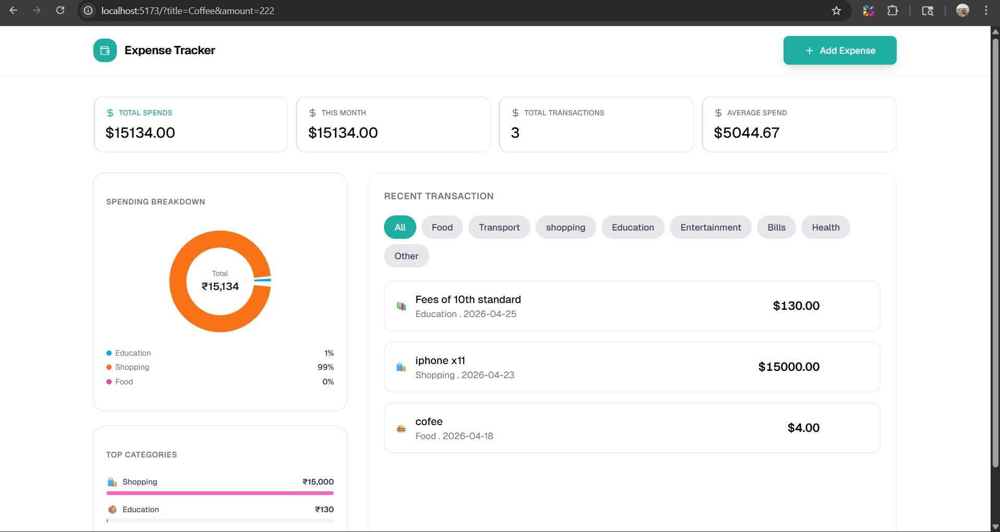

```md
# 💸 Expense Tracker Backend

A minimal yet powerful backend for managing expenses, built with Node.js, Express, TypeScript, and MongoDB.

---

## 📸 Preview



---

## 🚀 Features

- RESTful API for expense management
- Create, Read, Update, Delete (CRUD) operations
- MongoDB with Mongoose
- TypeScript support
- Clean folder structure
- Error handling middleware
- Environment-based configuration

---

## 🏗️ Tech Stack

- Node.js
- Express.js
- TypeScript
- MongoDB + Mongoose
- ts-node-dev (for development)

---

## 📁 Folder Structure

```

backend/
│
├── src/
│   ├── controllers/        # Business logic
│   ├── models/             # Mongoose schemas
│   ├── routes/             # API routes
│   ├── middleware/         # Custom middleware
│   └── index.ts            # Entry point
│
├── .env                    # Environment variables
├── package.json
├── tsconfig.json
└── README.md

```

---

## ⚙️ Setup Instructions

### 1️⃣ Install Dependencies

```

npm install

```

---

### 2️⃣ Environment Variables

Create a `.env` file in the root:

```

MONGO_URI=mongodb://localhost:27017/expense-tracker
PORT=5000

```

---

### 3️⃣ Run Development Server

```

npm run dev

```

Server will start on:
```

[http://localhost:5000](http://localhost:5000)

```

---

## 📡 API Endpoints

### 🔹 Get All Expenses
```

GET /api/expenses

```

---

### 🔹 Create Expense
```

POST /api/expenses

```

**Body:**
```

{
"title": "Groceries",
"amount": 500,
"category": "Food",
"date": "2026-04-18"
}

```

---

### 🔹 Update Expense
```

PUT /api/expenses/:id

```

---

### 🔹 Delete Expense
```

DELETE /api/expenses/:id

```

---

## 🧠 Data Model

### Expense Schema

```

{
title: string;
amount: number;
category: string;
date: string; // YYYY-MM-DD
}

```

---

## ⚠️ Important Note (Dates)

- Dates are stored as **string (YYYY-MM-DD)**  
- Avoids timezone issues (UTC shift problem)  
- Recommended for expense tracking apps  

---

## 🧩 Scripts

```

npm run dev     # Start dev server
npm run build   # Compile TypeScript
npm start       # Run production build

```

---

## 🛠️ Middleware

### Error Handler

Handles all server errors gracefully:

```

errorHandler.ts

```

---

## 🔮 Future Improvements

- Authentication (JWT + Cookies)
- Pagination & filtering
- Category management
- Analytics & reports

---

# 🌐 Expense Tracker Frontend

A modern React frontend for managing expenses with a clean UI and smooth UX.

---

## 🚀 Features

- Add / Edit / Delete expenses
- Date picker integration
- Form validation (React Hook Form)
- Responsive design
- API integration with backend

---

## 🏗️ Tech Stack

- React
- TypeScript
- Vite
- React Hook Form
- date-fns
- Tailwind CSS / ShadCN UI

---

## 📁 Folder Structure

```

frontend/
│
├── src/
│   ├── components/
│   ├── pages/
│   ├── hooks/
│   └── utils/
│
└── README.md

```

---

## ⚙️ Setup Instructions

### 1️⃣ Install Dependencies

```

npm install

```

---

### 2️⃣ Run Development Server

```

npm run dev

```

App will run on:
```

[http://localhost:5173](http://localhost:5173)

```

---

## 🔗 API Integration

Base URL:
```

[http://localhost:5000/api/expenses](http://localhost:5000/api/expenses)

```

---

## 🧠 Form Handling

- Uses **React Hook Form**
- Validation rules for required fields
- Controlled components with `Controller`

---

## 📅 Date Handling

- Uses `date-fns` for formatting
- Stores date as:
```

YYYY-MM-DD

```
- Prevents timezone shift issues

---

## 🔮 Future Improvements

- Dashboard analytics (charts)
- Filters (date range, category)
- Dark mode 🌙
- Authentication UI

---

## 👨‍💻 Author

**Awdhesh Gaund**

---

## 📄 License

MIT License
```
